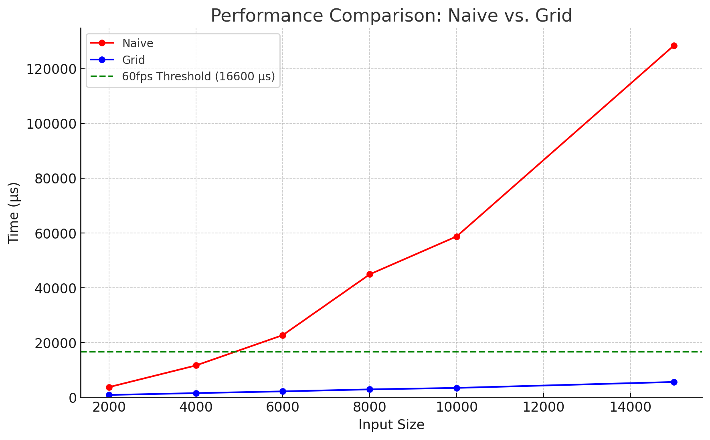

# Collision detection
Collision detection is a time consuming process in today's 2D/3D games, so it's essential to speed it up. 
In this repository, you can see how much faster the collision detection can be made by dividing the plane into grids.

The most naive way for collision detection is detectioning all $\binom{N}{2}=\frac{N(N-1)}{2}$ pairs of objects. 
However, this is quite inefficient because it becomes quadratically slower as n increases. 

You can make this naive algorithm faster by dividing the plane into grids. 
When doing collision detection, it's sufficient to detection only the pairs inside the same grid (*1). 
If the number of grids is $G$ and the objects are well scattered across the plane, one grid contains $N/G$ objects on average. 
Therefore, the number of pairs that have to be detectioned is $G\times \binom{N/G}{2}\approx \frac{N^2}{2G}$, which is about $G$ times smaller than the naive algorithm.
The time complexity is still quadratic with respect to $N$, but it's much better than the naive one if you set $G$ reasonably large.

(*1 : It is assumed that the object are much smaller than a grid.)

## Benchmark
The fps of many modern video games is 60 fps, which means collision detection should be in less than 1000/60=**16.6ms** (*2). The following graph shows the time taken for collision detection while varying the number of objects.

You can see the naive algorithm already exceeds 16.6ms threshold when $n=6000$ while grid partitioning algorithm is well below the threshold even when $n=15000$.

I also detectioned how much the smoothness differs between the naive algorithm and the grid partitioning algorithm when $n=15000$. The first video is for the naive algorithm and the second one is for the grid partitioning algorithm. You can clearly see grid partitioning is much smoother than the naive algorithm.

(*2 : In real video games, there are other overheads other than collision detection (e.g. drawing objects on the screen), so the collision detection itself needs to be even faster than this if you actually want to run the game at 60fps.)
